# #30DayChartChallenge 2026 Edition

## My concept for this year run

In 2026, coding can never be the same for me. It would be ridiculous to pretend that LLMs are not better than me at coding, or at least much faster. So this year I decided to participate in the challenge with most of the heavylifting done by AI helpers. I created a dedicated space in perplexity with the system prompt that you can see [here](doc/system-prompt.md). I will also link to the chats with LLMs for transparency and probbaly also educational purposes. And yes, I expect that this setting will actually allow me participate wihtout an extreme toll on my available time. 

## #30DayChartChallenge topics

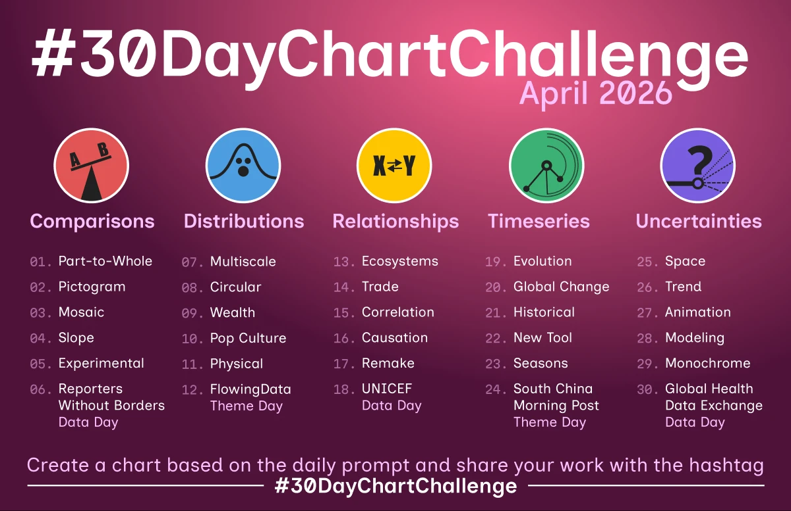

# My contributions

|                            |                         |                            |                             |                           |
|----------------------------|-------------------------|----------------------------|-----------------------------|---------------------------|
| [01 part-to-whole](#day-1) | [07 multiscale](#day-7)   | [13 ecosystems](#day-13)  | [19 evolution](#day-19) | [25 space](#day-25) |
| [02 pictogram](#day-2)     | [08 circular](#day-8)    | [14 trade](#day-14)        | [20 global change](#day-20)       | [26 trend](#day-26)      |
| [03 mosaic](#day-3)    | [09 wealth](#day-9) | [15 correlation](#day-15) | [21 historical](#day-21)     | [27 animation](#day-27) |
| [04 slope](#day-4)       | [10 pop culture](#day-10)  | [16 causation](#day-16)        | [22 new tool](#day-22)     | [28 modeling](#day-28)      |
| [05 experimental](#day-5)         | [11 physical](#day-11)  | [17 remake](#day-17)  | [23 seasons](#day-23)         | [29 monochrome](#day-29)  |
| [06 FlowingData](#day-6)  | [12 Reporters Without Borders](#day-12)    | [18 South China Morning Post](#day-18)  | [24 UNICEF](#day-24)    | [30 Global Health Data Exchange](#day-30)          |

## Day 1

2026-04-01 \| part-to-whole \|
[code](src/01-part-to-whole.r) \|
[pplx](https://www.perplexity.ai/search/day-1-part-to-whole-let-s-play-9r2UB4azS3iaj5urON4OXg) \|
[bsky](https://bsky.app/profile/ikashnitsky.phd/post/3mihz3q3aa22m)

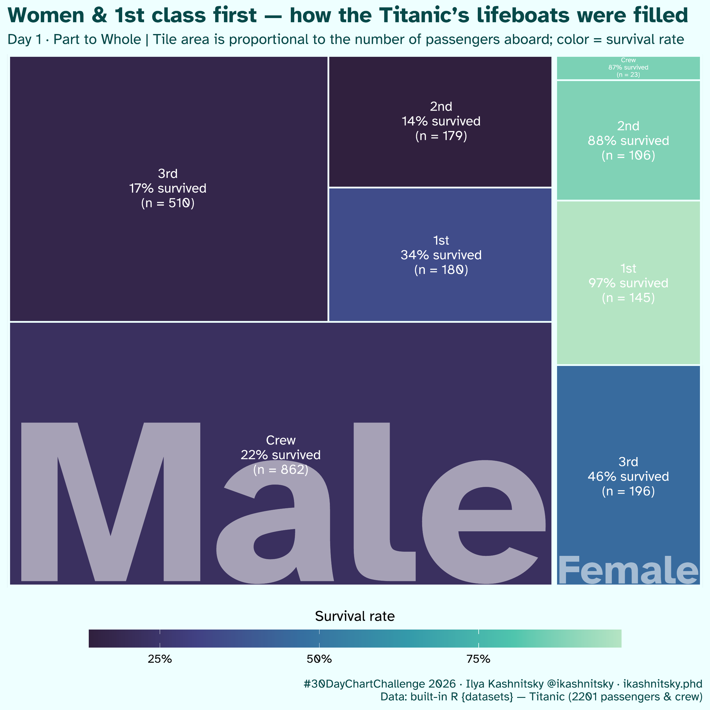

## Day 2

2026-04-02 \| pictogram \|
[code](src/02-pictogram.r) \|
[pplx](https://www.perplexity.ai/search/day-2-pictogram-visualize-my-d-5.dmFgnySe.ZSfIqBHgSng) \|
[bsky](https://bsky.app/profile/ikashnitsky.phd/post/3miilklu7mc2m)

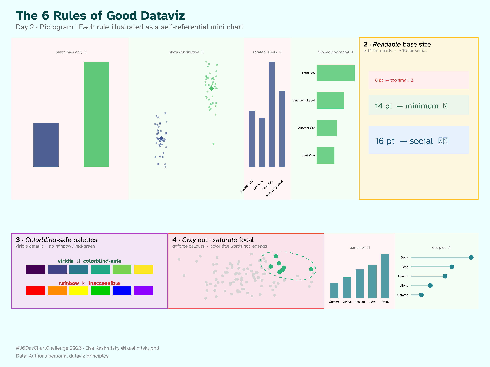

Alternative (no code): [gemini](https://g.co/gemini/share/33e4c78ebbf5) \|
[bsky](https://bsky.app/profile/ikashnitsky.phd/post/3miilklu7mc2m)

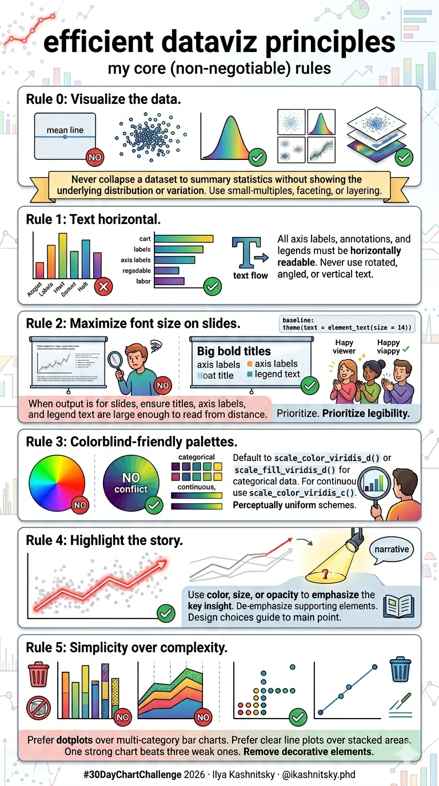

## Day 3

2026-04-03 \| mosaic \|
[code](src/03-mosaic.r) \|
[pplx](https://www.perplexity.ai/search/day-3-mosaic-let-s-use-this-ti-zDS__DsJRq.JzH_jXJ7NVw) \|
[bsky](https://bsky.app/profile/ikashnitsky.phd/post/)

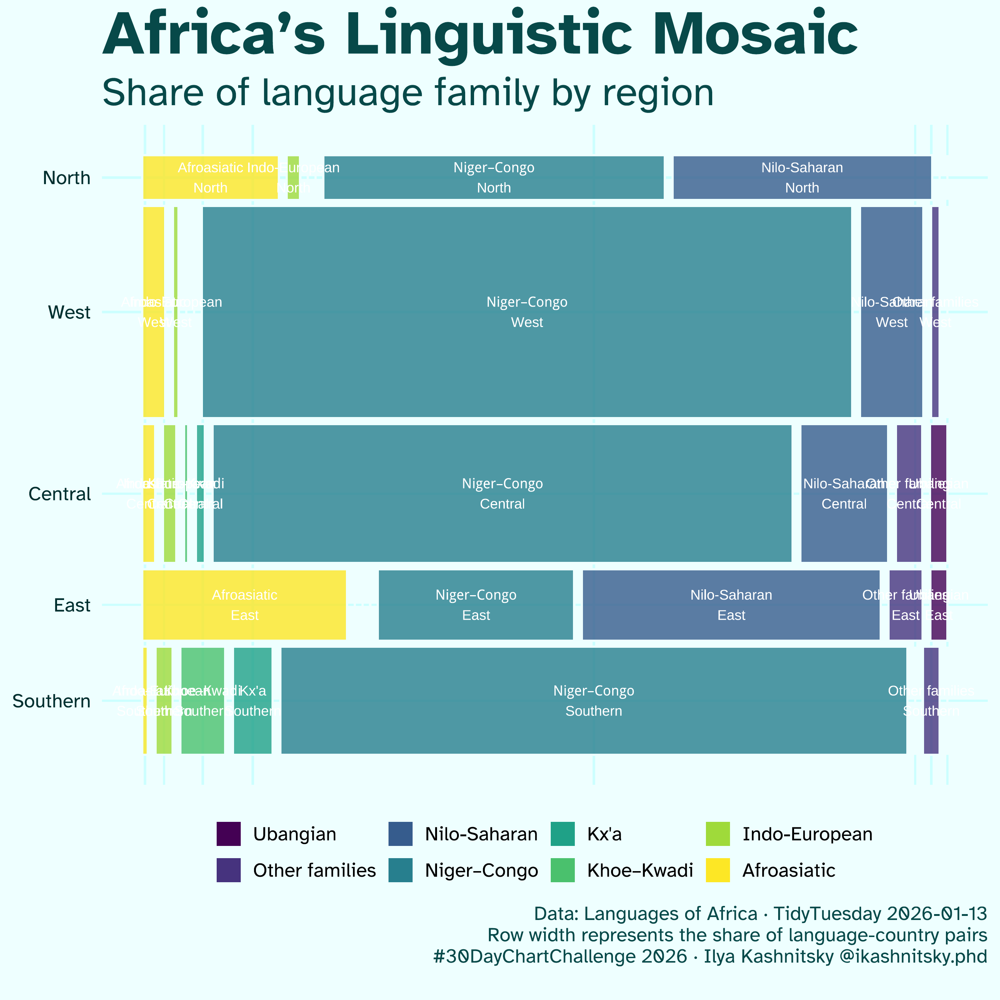

## Day 4

2026-04-04 \| slope \|
[code](src/04-slope.r) \|
[pplx](https://www.perplexity.ai/search/day-4-slope-let-s-visualize-in-yMJ4ws41Qmimh9H2O9G5HA) \|
[bsky](https://bsky.app/profile/ikashnitsky.phd/post/3minpvrwemc2h)

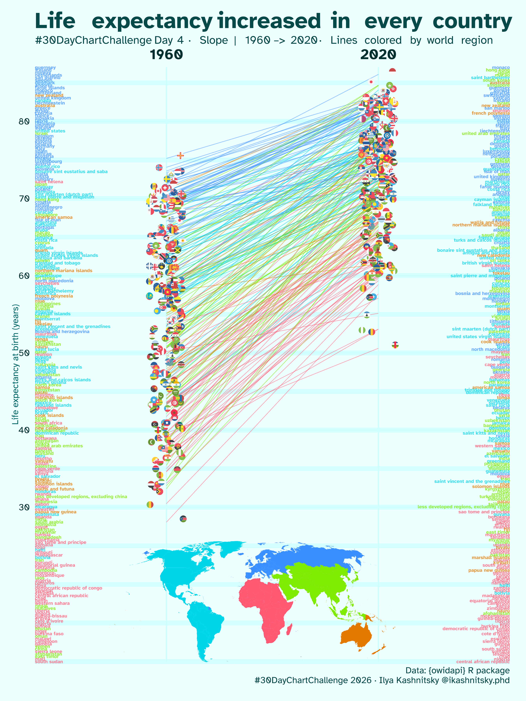

## Day 5

2026-04-05 \| experimental \|
[code](src/05-experimental.r) \|
[pplx](https://www.perplexity.ai/search/day-5-experimental-for-today-i-ldYZ2qw3Q3qBmwhhF902CQ) \|
[bsky](https://bsky.app/profile/ikashnitsky.phd/post/3mipyshnmak2t) \| [INETRACTIVE D3](https://ikashnitsky.phd/x/d3/05-experimental.html)

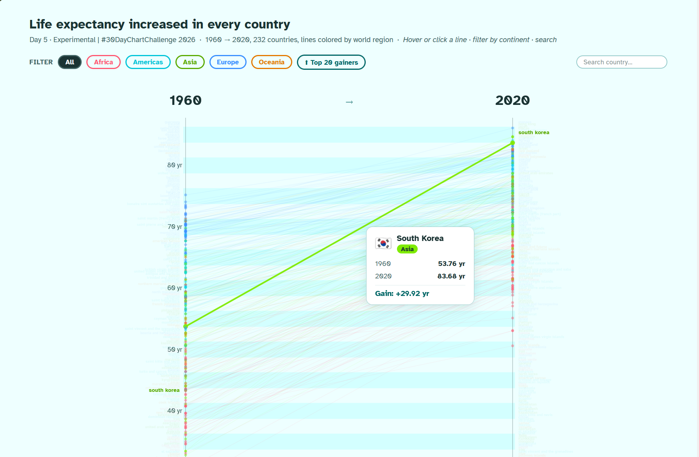

## Day 6

2026-04-06 \| Reporters Without Borders \|
[code](src/06-reporters-without-borders.r) \|
[pplx](https://www.perplexity.ai/search/day-6-reporters-without-border-0fnnJjJOT8.MzEP6EMtgWw) \|
[bsky](https://bsky.app/profile/ikashnitsky.phd/post/3misosgewmk2t) 

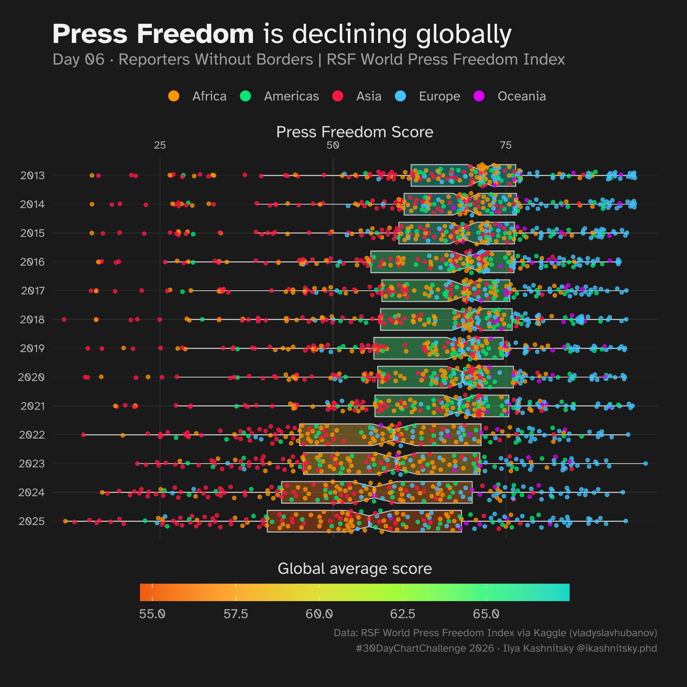

## Day 7

2026-04-07 \| multiscale \|
[code](src/07-multiscale.r) \| 
[pplx](https://www.perplexity.ai/search/day-7-multiscale-let-s-build-a-w1hJw63kTy2j3oKyYOdTfg) \|
[bsky](https://bsky.app/profile/ikashnitsky.phd/post/3mivj526vb22r) 

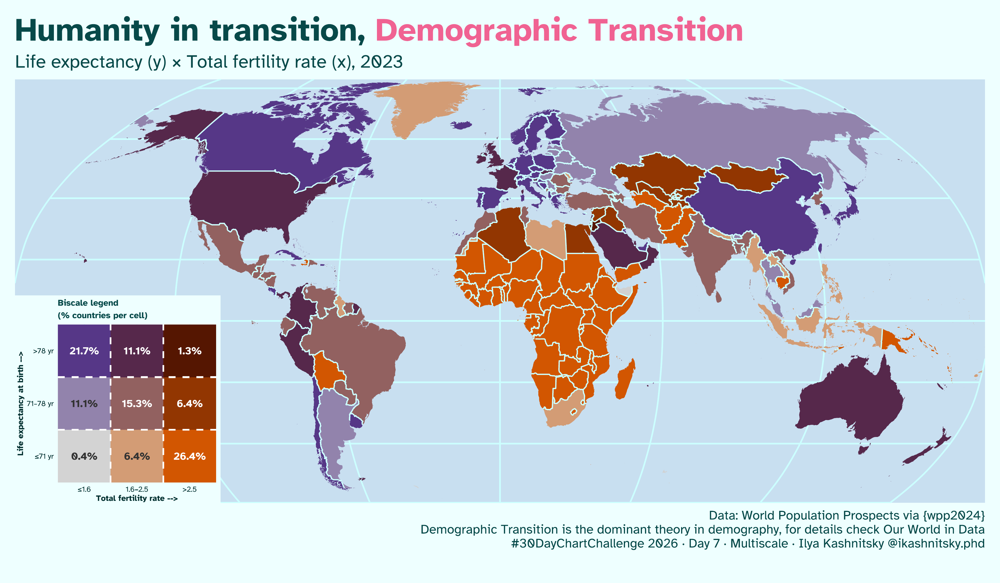

## Day 8

2026-04-08 \| circular \|
[code](src/08-circular.r) \| 
[pplx](https://www.perplexity.ai/search/day-8-circular-let-s-brainstor-v.oDoV8MSyGgZpsKrbrUfg) \|
[bsky](https://bsky.app/profile/ikashnitsky.phd/post/3mixl6e5lok24) 

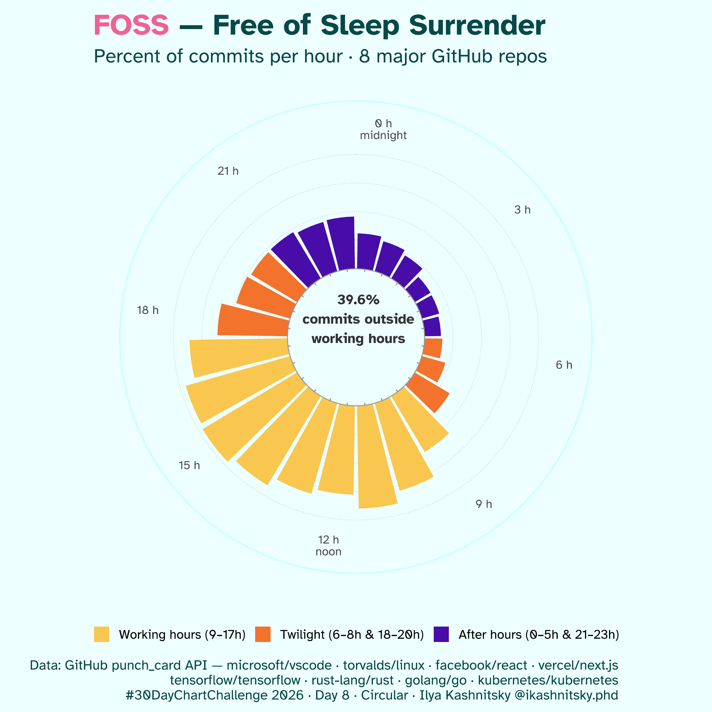

## Day 9

2026-04-09 \| wealth \| 
[code](src/09-wealth.r) \| 
[pplx](https://www.perplexity.ai/search/day-9-wealth-let-s-explore-wor-OrnqM3hMTa2y1_VvXZDOYA) \|
[bsky](https://bsky.app/profile/ikashnitsky.phd/post/3mj2iaul6js2l) 

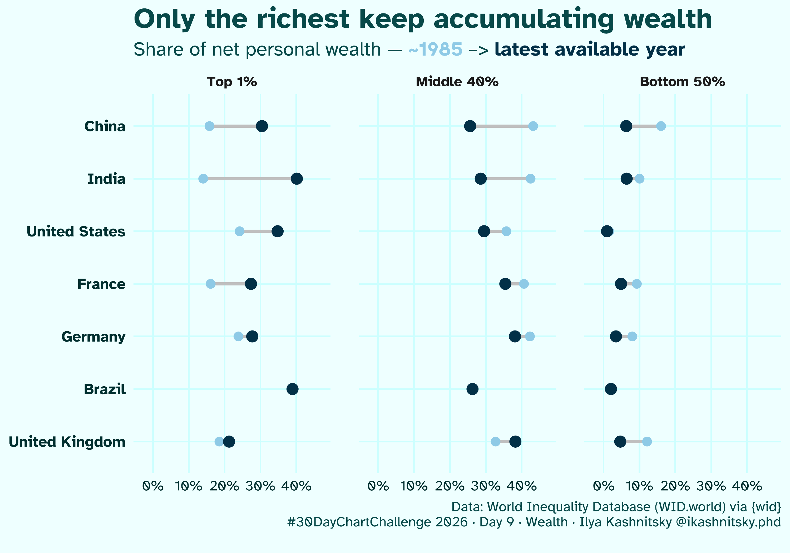

## Day 10

2026-04-10 \| pop culture \|
[code](src/10-pop-culture.r) \|
[pplx](https://www.perplexity.ai/search/day-10-pop-culture-let-s-brain-9xskCxDnT7Wy4ot20nVu5w) \| 
[bsky](https://bsky.app/profile/ikashnitsky.phd/post/3mj66ams6js2f) 

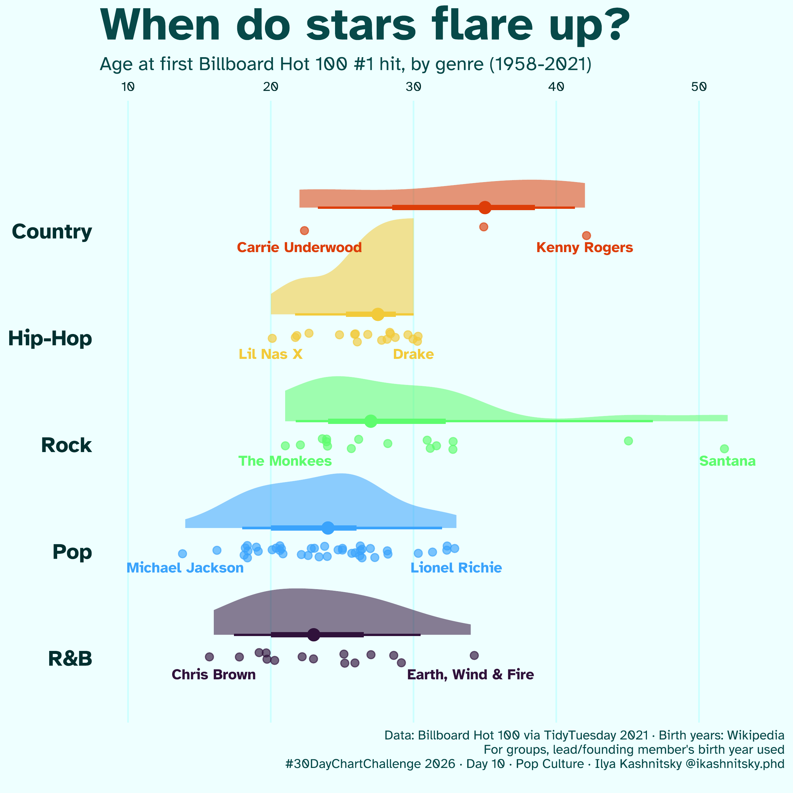

## Day 11

2026-04-11 \| physical \|
[code](src/11-physical.r) \|
[pplx](https://www.perplexity.ai/search/day-11-physical-i-have-an-idea-zBoAcQsAQhW22FDWl_KzGQ) \| 
[bsky](https://bsky.app/profile/ikashnitsky.phd/post/3mjd4uqemsk2b) 

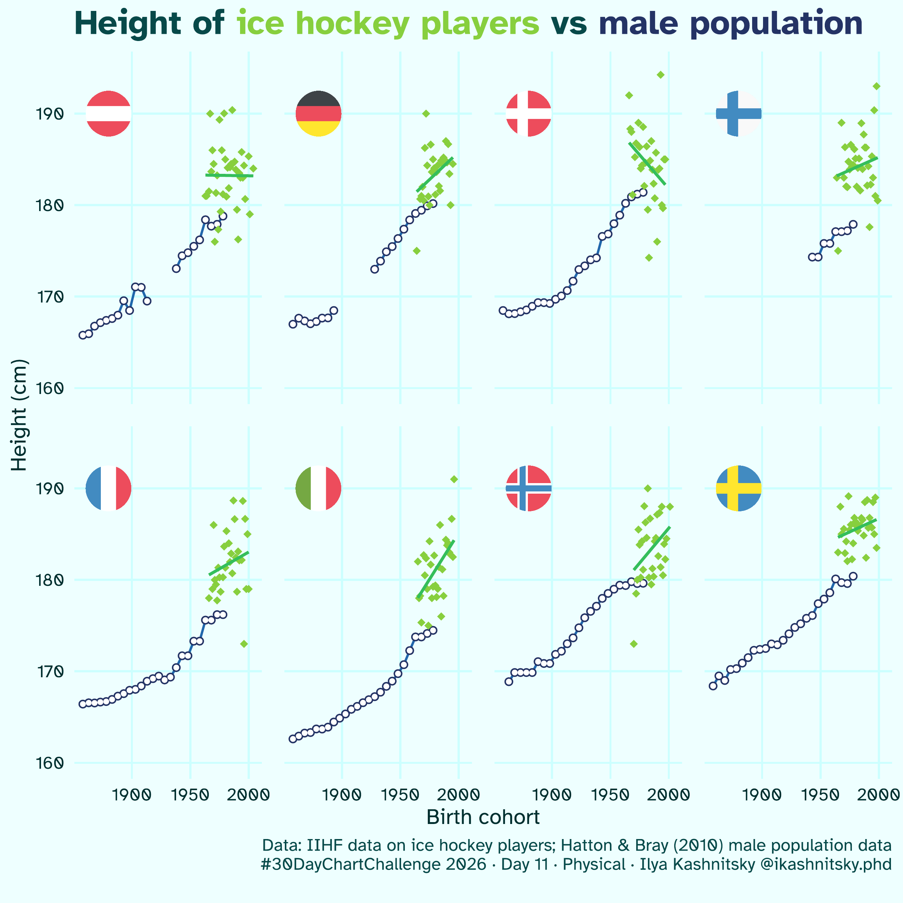

